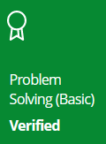

    

		
	
	
	
	

# HackerRank | Practice, Tutorials & Interview Preparation Solutions

This repository consists of solutions to HackerRank **practice**, **tutorials**, and **interview preparation** problems with **C#**, **Python**.

# Disclaimer

This is throw-away code that is only supposed to correctly get the job done. I used the code stubs provided by HackerRank, so don't mind the unnecessary imports, naming convention and so on.

# Table of Contents

* [HackerRank Profile](#hackerrank-profile)
* [Certificates](#certificates)
* [Badges](#badges)
* [Tasks completed](#tasks-completed)

## HackerRank Profile

[View Profile](https://www.hackerrank.com/vladislavirkin)

## Certificates

## Badges

## Tasks completed

* [Practices](#practices)
* [Tutorials](#tutorials)
* [Interview Preparation Kit](#interview-preparation-kit)

### Practices

* [Problem Solving](./docs/)
* [One week preparation kit](./docs/)

### Tutorials

### Interview Preparation Kit
